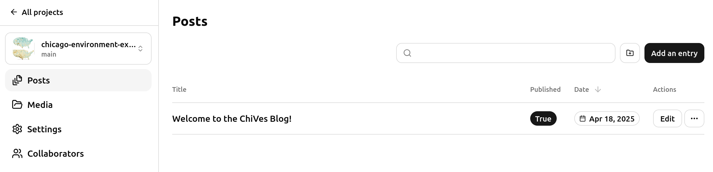
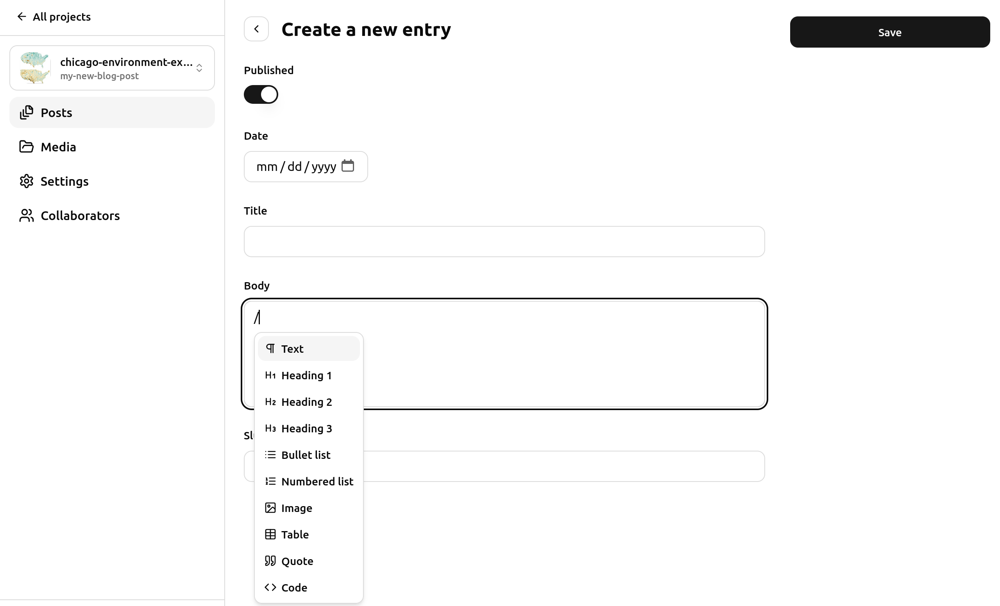

# ChiVes: Chicago Environment Explorer
### [ChiVes](https://chichives.com/) is a data collaborative and community mapping application that brings data on Chicago’s environment together at the neighborhood level.

# About

Chicago's urban environment has profound impacts on the health of communities and individuals. A handful of key metrics―tree cover, air pollution estimates, heat island effects, traffic volumes, and social vulnerability index― help to reveal where in the city people face particular challenges as we work towards a healthier Chicago.

ChiVes is a data collaborative and community mapping application that brings data on Chicago’s environment together at the neighborhood level. It’s a partnership of researchers, community organizations, and civic groups. With ChiVes, we harmonize & standardize environmental data across dozens of sources to make it accessible for full exploration, alongside a growing list of resources on the Chicago Environment, cultivated by a community of curators.

This project refactors data from the a previous partnership with the City of Chicago, and gets customized as a new opensource platform for the wider community.

This current project version is being managed by the [Healthy Regions & Policies Lab (HeRoP)](https://healthyregions.org/) at the Department of Geography & GIScience at the University of Illinois at Urbana-Champaign in collaboration with the Department of Geography at DePaul University. From 2022-2024, this project is funded in part from NASA to support environmental justice applications in communities. The original ChiVes (refactored data and integration of previous projects) emerged from HeRoP while at the Center for Spatial Data Science at the University of Chicago by Dylan Halpern with content from M. Kolak, L. Menendez, I. Kamber, and more. 

## Get Involved

Have data to add? A mapping resource to recommend? We invite you to add more resources to the ChiVes explorer as build out an open data coalition to prepare Chicago for a more resilient future.

Organizations and individuals can participate in ChiVes in multiple ways:

* [Data Collaborative](https://docs.google.com/forms/d/e/1FAIpQLSdu5zCJcvLXp8eY0p3jLuCWPKSuGHjrw2auO3BsD57ssH4_wA/viewform). Integrate your data directly. Members agree that the final, integrated data will meet Collaborative standards.
* [Resource Guide](https://docs.google.com/forms/d/e/1FAIpQLSd2gHSB7OKCKEBhB0weIM7ZsRBomVOAl7QhDHOeXu5B7ih_bQ/viewform). Share your web-based or print media resource on the Chicago environment. Resources must meet ChiVes standards.
* [Web Development](https://github.com/healthyregions/chicago-environment-explorer). Developers and code-enthusiasts can fork the ChiVes website, make changes, and submit for review.

View our [Standards and Submission Guidelines](https://docs.google.com/document/d/12lwkCAXxI9eW4Mdf6gaeR6LCsaNI3E0E6xvi7dqXr9k/edit?usp=sharing) for more information. These guidelines are evaluated on a regular basis by members of the Data Collaborative.

Learn more on our [About](https://chichives.com/about) page, and feel free to [Contact Us](https://chichives.com/contact) with any questions. 

# Features

There are several ways to get started using ChiVes and exploring Chicago's environment:

## [Search by Address](https://chichives.com/)
Got somewhere you want to explore? Search for an address on the homepage to navigate directly to your neighborhod. 


----

## [Find Your Community](https://chichives.com/community)
Get a dynamic community report about key indicators and environmental metrics for your neighborhood. Search by your location.


----

## [Start Mapping](https://chichives.com/map)
Explore dimensions of the environment across Chicago in an interactive map. Data comes from collaborators across the city!


----

## [Learn More](https://chichives.com/guide)
Discover other maps, data, and resources about the Chicago environment from featured partners and a curated list of resources.


# Blog

ChiVes incorporates a basic static blog setup, using [PagesCMS](https://pagescms.org).

## How to create a new post

### 1. Go to https://app.pagescms.org/healthyregions/chicago-environment-explorer/

Log in with your GitHub credentials and you'll see something like this:



PagesCMS provides a web UI that allows us to create and edit Markdown files directly in our repository

### 2. Create a new branch for your post

https://github.com/user-attachments/assets/3ce8fa06-3f69-4b0d-9d32-3a78db600bfb

Using this branch workflow allows us to keep a cleaner repository change history.

### 3. Create your post with Title, Date, and Body content.



### 4. Set a Slug before clicking "Save".

The Slug is used for the file name and url of this post. Use only lower-case letter, and hyphens instead of spaces.

Example:

```
Title: Upcoming ChiVes Symposium
Slug: upcoming-chives-symposium
```


Once your blog post is ready, let @mradamcox or @bodom0015 know and we'll make a Pull Request to publish the post on the main site.


### 5. (Optional) Add a Sticker for your Blog Post on the Map

On PagesCMS, choose the Community Stickers collection and click "Add an entry" at the top-right.

Enter title/subtitle, an image, lat/lon coordinates, and the slug of an existing blog post.


Click Save to create the sticker as a new file.

Submit this new file as part of your pull request to publish your sticker to the public ChiVes map


# Data

ChiVes uses harmonized, standardized environmental data at the census tract scale including tree canopy characteristics, surface temperature, logged traffic volume, urban flood susceptibility, social vulnerability, hardship, modeled fine particulate matter estimates, and more in Chicago, IL around 2018 (data ranges from 2010-2018). Learn more on the [Data](https://chichives.com/data) page.

## Data Standards & Submission Guidelines
See the [Standards & Submissions Guidelines](https://docs.google.com/document/d/12lwkCAXxI9eW4Mdf6gaeR6LCsaNI3E0E6xvi7dqXr9k/edit#heading=h.3v2r5cc9r630) for complete information. This resource includes information on:
* [Collaborative Guidelines](https://docs.google.com/document/d/12lwkCAXxI9eW4Mdf6gaeR6LCsaNI3E0E6xvi7dqXr9k/edit#bookmark=id.oh5pq3bjlkt5), including data standards, resource guide standards, and web development standards; and 
* [Submission Guidelines](https://docs.google.com/document/d/12lwkCAXxI9eW4Mdf6gaeR6LCsaNI3E0E6xvi7dqXr9k/edit#bookmark=id.u9fqnrjfymzb), including an overview of the submission process, publishing data with Google spreadsheets, and a metadata template.

## Download 
Download the latest version of our data here, or see the [Data](https://chichives.com/data) page: 
* [ShapeFile](https://chichives.com/shp/chives-data.zip)
* [GeoJSON](https://chichives.com/geojson/chives-data.geojson)
* [CSV / Excel](https://chichives.com/csv/chives-data.csv)

This data is licensed under a [Creative Commons Attribution Non-Commercial license](https://creativecommons.org/licenses/by-nc/2.0/).

## Data Dictionary
See [Data](https://chichives.com/data) page.

## Map Variables and Data Sources
See [Data](https://chichives.com/data) page.

## Local Build

See the development [docs](./docs) for how to build and run this application.
