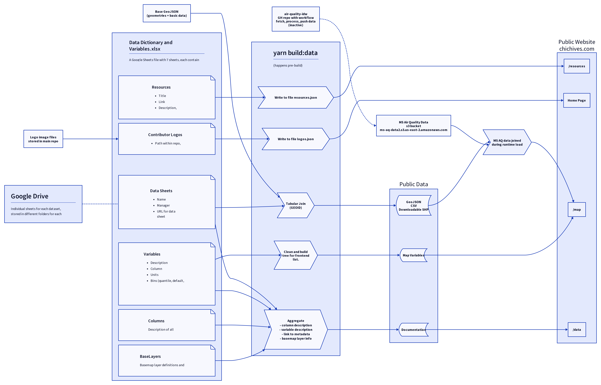

# Development Documentation

This application is build from [WebGeoDa](https://docs.webgeoda.org/).

## Required Environment Variables
The below are required environmnent variables. These should be available in `.env` or `.env.local` in your repo root. Don't commit them to Github. You can copy `.env.example` to `.env` and fill in the blank values.

```
# mapbox token for map
REACT_APP_MAPBOX_TOKEN=pk...

# air quality endpoint
REACT_APP_AQ_ENDPOINT=https:...

# submission url for google form
REACT_APP_EMAIL_FORM_URL=
```

## Installing and Running the App

```
yarn install
yarn build:data
yarn start
```

#### `yarn build:data`

Fetch and build relevant data. You must run this prior to development. 

This builds 4 main things:
- Main data for the application
- Map variable specification
- Documentation for the docs / about page
- Resource page entries and contributor logs for home page

This process is shown in context in the following diagram.



*Dev note: use `d2 docs/chives-build-data.d2 docs/chives-build-data.png --pad 20` to regenerate this diagram. [learn more about D2](https://d2lang.com/)*

Data is pulled from the data management document described in the [Content Management System](#content-management-system) section below.

#### `yarn start`

Runs the app in the development mode.\
Open [http://localhost:3000](http://localhost:3000) to view it in the browser.

The page will reload if you make edits.\
You will also see any lint errors in the console.

#### `yarn test`

Launches the test runner in the interactive watch mode.\
See the section about [running tests](https://facebook.github.io/create-react-app/docs/running-tests) for more information.

#### `yarn build`

Builds the app for production to the `build` folder.\
It correctly bundles React in production mode and optimizes the build for the best performance.

The build is minified and the filenames include the hashes.\
Your app is ready to be deployed!

See the section about [deployment](https://facebook.github.io/create-react-app/docs/deployment) for more information.

#### `yarn eject`

**Note: this is a one-way operation. Once you `eject`, you can’t go back!**

If you aren’t satisfied with the build tool and configuration choices, you can `eject` at any time. This command will remove the single build dependency from your project.

Instead, it will copy all the configuration files and the transitive dependencies (webpack, Babel, ESLint, etc) right into your project so you have full control over them. All of the commands except `eject` will still work, but they will point to the copied scripts so you can tweak them. At this point you’re on your own.

You don’t have to ever use `eject`. The curated feature set is suitable for small and middle deployments, and you shouldn’t feel obligated to use this feature. However we understand that this tool wouldn’t be useful if you couldn’t customize it when you are ready for it.

## Content Management System

The CMS for ChiVes is managed in Google Drive, and configured entirely through a Google Sheets file called **Data Dictionary and Variables.xlsx**. This file has multiple sheets, all of which are downloaded and parsed during the `yarn build:data` step described above. Commonly, cells in these sheets link out to other data sheets and metadata documents that are stored in different Google Drive folders.

A full summary of all sheets and fields in this file follows.

### `Data Sheets`

This sheet links out to all of the contributed data sheets that hold the various variables described in other sheets. These data sheets are all merged into a single GeoJSON file, which forms the basis of the map display and downloadable data.

- `Name`: name of data
- `Manager`: Owner of data
- `Data Sheet Link`: CORS accessible CSV endpoint or file URL
- `Meta Data Link`: Link to the metadata document for this sheet. *This may not be used, in fact, as metadata documents are better linked directly to individual variables, not entire data sheets...*

### `Columns`

This is a full list of all columns in all sheets. It is used to drive the Data Dictionary that is presented on the ChiVes Data page. It is also where you determine whether a given field will be included in the full public download file.

- `Column`: column name in data
- `Description`: Text description of data
- `Downloadable`: Yes/No, whether this column should be distributed in the download

### `Categories`

A list of categories (i.e. "display groups") that are used to sort the presentation of variables in the map and index builder variable dropdown lists. These categories determine the available `listGroup` options for variables.

- `Category Name`: display name
- `Sort Order`: sort order for listing

### `Variables`

This sheet holds the most detailed set of information for all of the variables that are shown on the map and index builder.

- `Variable Name`: Display name of the variable
- `Column`: Name of data column in the Columns sheet *and* in the source data sheets.
    - Controlled vocabulary &rarr; `Columns:Column`
- `units`: suffix, eg `%`
- `Description`: HTML description for in-map description of variable
- `Data Year`: data year
- `Data Source(s)`: data sources
- `Original Scale`: origin geospatial unit
- `Metadata Doc`: link to full metadata
- `Bins`: If specifying bin scale, otherwise quantile
- `colorScale`: rgb[] | rgba[] repeated bins
- `Added By`: data attribution
- `listGroup`: grouping on the variable drop down
    - Controlled vocabulary &rarr; `Categories:Category Name`
- `custom`: if custom layer, indicated an ID here and integrate that on the frontend
- `active`: Set to FALSE to hide the variable from the UI in all views: Map, Data, Index Builder, etc.
    - Controlled vocabulary &rarr; `TRUE` | `FALSE`
- `ibDefaultDirectionality`: Determines whether a variable's value affects the overall index positively or negatively
- `ibEnabled`: Determines whether or not a variable will be available in the custom Index Builder
    - Controlled vocabulary &rarr; `TRUE` | `FALSE`
- `ibIgnoreZero`: Determines whether values of 0 in this variable should be ignored in the index creation
    - Controlled vocabulary &rarr; `TRUE` | `FALSE`
- `ibExplanation` (for consideration): Short text description that explains the rationale for a given variable's `ibDefaultDirectionality` value

### `Categories`

This sheet provides categories that are used to group variables in the frontend Map Variables list.

- `Category Name`: Display name of the category
- `Order`: Sort order for category in output list

### `Overlays`

Along with Map Variables, the web map features a set of "Data Overlays" that provide reference layers from a variety of different sources. These items are defined in the `Overlays` sheet.

- `id`: Id for this overlay (must be unique across overlays)
- `displayName`: Name to display in user interface
- `description`: Description of overlay (not currently utilized on frontend)
- `dataType`: Must be `geojson` or `csv`. If `csv`, then `geometryType` must be `point`, and headers must include `latitude` and `longitude`.
- `dataSource`: URL to public location of raw data content
- `geometryType`: Must be `point` or `polygon`. If `dataType` is `csv`, only point geometry is supported.
- `symbolProp`: Optionally define a column whose values will be keyed to different colors (defined in `fillColor`)
- `lineColor`: RGBA value for color of outline (only used for `polygon`), example: `[0,0,0,255]`
- `lineWidth`: Width of outline (only used for `polygon`), example: `1`
- `fillColor`: Color for fill (only used for `polygon`)
    - For single color across all polygons, use RGBA: `[0,0,0,255]`
    - For categories based on values in `symbolProp` field, use mapping like this example (here, there are values A, B, C, and D in the column):
        ```
        {
            "A": [115, 169, 77],
            "B": [52, 172, 198],
            "C": [219, 207, 0],
            "D": [226, 77, 90]
        }
        ```
    - If your chosen `symbolProp` has an array value, you can also specify combinations of different keys: for example "A & B". These keys should appear in alphabetical order using ampersand (&) as a separator. Remember to assign a color for all present combinations of keys. For an example, see the "EPA Monitoring Sites" Overlay.
- `popupTitle`: Optionally set the title for clickable popups on each feature, example: `{site_name}`.
- `popupContent`: Optionally set a mapping for columns -> display titles to define what shows up in a popup. For example:
    ```
    {
        "site_type": "Site Type",
        "site_name": "Site Name",
        "address": "Address",
        "city": "City",
        "state": "State",
        "zip": "ZIP",
        "hours_of_operation": "Hours of Operation",
        "phone": "Phone"
    }
    ```
- `filterProp`: not implemented
- `filterDisplayName`: not implemented

### `Basemap Layers`

A few custom layers are incorporated within the basemap for the main map view. This data is typically incorporated directly into the basemap style, so no data sheets are stored in Google Drive for this content.

- `Variable Name`: name of variable
- `Data Year`: data year
- `Data Source(s)`: data sources
- `Original Scale`: origin geospatial unit
- `Metadata Doc`: link to full metadata
- `Added By`: data attribution

### `Resources`

This is the list of resources displayed in the /resources page.

- `title`: title of resource
- `link`: link to resource
- `text`: text description of resource
- `logo`: logo of resource - path relative to chives repo > public folder
- `image`: image of resource - path relative to chives repo > public folder
- `logoAltText`: alt text for logo
- `imageAltText`: alt text for image
- `dateAdded`: date added to resource guide
- `verified`: if verified by chives team

### `Contributor Logos`

This is the list of contributor logos displayed on the home page.

- `Contributor`: name of contributor
- `Link`: link to contributor's website
- `ImagePath`: path to contributor's logo - path relative to chives repo > public folder
- `AltText`: alt text for logo
